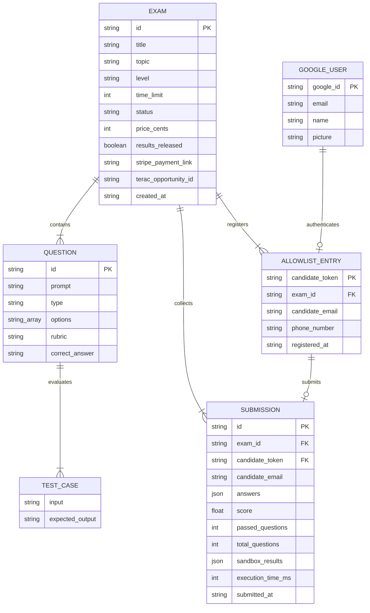

# Database Tables & Data Schemas

The **Zero-Human Autonomous Assessment Platform** uses Pydantic data schemas defined in [`database.py`](file:///Users/auhuman/workplace/ZeroHumanHackathon/database.py). Below is the complete technical documentation of all entity tables, schemas, field data types, relationships, and lifecycle states.

---

## Entity Relationship Diagram (ERD)



---

## 1. `Exam` Table / Schema

Stores high-level assessment metadata, Pioneer AI baseline generation, Terac expert review diffs, Lovable UI styling configs, and Stripe pricing.

| Field | Data Type | Default / Constraints | Description |
| :--- | :--- | :--- | :--- |
| **`id`** *(PK)* | `str` | UUID `str(uuid4())` | Primary key identifier for the exam |
| **`title`** | `str` | Required | Auto-generated title (e.g. *"Python Async Microservices"*) |
| **`topic`** | `str` | Required | Subject domain input by the organizer |
| **`level`** | `str` | `"Intermediate"` | Target difficulty: `"Senior Staff" \| "Intermediate" \| "Entry Level"` |
| **`time_limit`** | `int` | `45` | Duration limit in minutes (15 to 180 mins) |
| **`status`** | `str` | `"DRAFT"` | Lifecycle state (see *Exam Lifecycle States* below) |
| **`price_cents`** | `int` | `1500` | Organizer entry fee in USD cents ($1.00 = 100, $15.00 = 1500) |
| **`questions`** | `List[Question]` | `[]` | Embedded array of `Question` objects |
| **`terac_diff`** | `Dict` | `None` | Quality improvement comparison (+18.5% expert rubric diff) |
| **`terac_submission`** | `Dict` | `None` | Raw webhook submission payload from Terac MCP |
| **`terac_opportunity_id`** | `str` | `None` | External opportunity ID on Terac platform |
| **`lovable_ui_config`** | `Dict` | `None` | Synced glassmorphic presentation theme & Monaco configuration |
| **`stripe_payment_link`** | `str` | `None` | Dynamic Stripe Checkout URL (`https://buy.stripe.com/...`) |
| **`results_released`** | `bool` | `False` | `True` when organizer releases final scores to candidates |
| **`created_at`** | `str` | ISO 8601 UTC | Timestamp of exam creation |

### Exam Lifecycle States (`Exam.status`)

```
🤖 GENERATING / DRAFT (0)
   └── 🔍 IN_REVIEW (1) [Submitted to Terac MCP]
        └── ✅ VERIFIED (2) [Review Complete -> Catalog Visible / Stripe Checkout Active]
             └── ⚡ ACTIVE (3) [Organizer Clicked Start -> Linq Candidate SMS Sent]
                  └── 🏁 COMPLETED (4) [Organizer Ended Exam]
                       └── 📢 RESULTS_RELEASED (5) [Scores & Ranks Released to Candidates]
```

---

## 2. `Question` Schema

Defines individual test items generated by Pioneer AI and refined by Terac human experts.

| Field | Data Type | Default / Constraints | Description |
| :--- | :--- | :--- | :--- |
| **`id`** *(PK)* | `str` | 8-char UUID | Unique question ID (e.g. `"q1"`, `"a8f2c19e"`) |
| **`prompt`** | `str` | Required | Technical problem prompt / question text |
| **`type`** | `str` | Required | `"mcq" \| "code" \| "short_answer"` |
| **`options`** | `List[str]` | `None` | Multiple choice options array (e.g. `["A) ...", "B) ..."]`) |
| **`rubric`** | `str` | `""` | Terac human-expert validated grading rubric |
| **`correct_answer`** | `str` | `None` | Correct option or answer key for automated grading |
| **`test_cases`** | `List[TestCase]` | `[]` | Automated test suite array for Python code execution |

---

## 3. `TestCase` Schema

Unit test pairs executed in the **Superserve Sandbox** container.

| Field | Data Type | Description |
| :--- | :--- | :--- |
| **`input`** | `str` | Function parameters or CLI stdin passed to code |
| **`expected_output`** | `str` | Expected stdout or return value |

---

## 4. `AllowlistEntry` Table / Schema (Subscribed Candidates)

Tracks registered & paid candidates authorized to attempt an assessment.

| Field | Data Type | Default / Constraints | Description |
| :--- | :--- | :--- | :--- |
| **`candidate_token`** *(PK)* | `str` | `tok_{hex12}` | Unique candidate access token issued upon registration/payment |
| **`exam_id`** *(FK)* | `str` | Foreign Key -> `Exam.id` | Exam the candidate registered for |
| **`candidate_email`** | `str` | Required | Registered candidate email address |
| **`phone_number`** | `str` | Required | Phone number used for Linq iMessage/SMS access link dispatch |
| **`registered_at`** | `str` | ISO 8601 UTC | Registration/Payment timestamp |

---

## 5. `Submission` Table / Schema (Candidate Workspace Answers)

Stores candidate answers, score metrics, and Superserve sandbox execution results.

| Field | Data Type | Default / Constraints | Description |
| :--- | :--- | :--- | :--- |
| **`id`** *(PK)* | `str` | UUID | Unique submission record ID |
| **`exam_id`** *(FK)* | `str` | Foreign Key -> `Exam.id` | Target exam ID |
| **`candidate_token`** *(FK)* | `str` | Foreign Key -> `AllowlistEntry` | Candidate token submitting the exam |
| **`candidate_email`** | `str` | Required | Email associated with the submission |
| **`answers`** | `Dict[str, str]` | `{}` | Key-value pairs: `question_id -> answer / python code` |
| **`score`** | `float` | `0.0` | Calculated overall percentage (0.0 to 100.0%) |
| **`passed_questions`** | `int` | `0` | Count of correctly answered / passing test case questions |
| **`total_questions`** | `int` | `0` | Total number of questions in assessment |
| **`sandbox_results`** | `Dict[str, Dict]` | `{}` | Per-question execution metrics (passed status, runtime, output) |
| **`execution_time_ms`** | `int` | `0` | Total code execution runtime in milliseconds |
| **`submitted_at`** | `str` | ISO 8601 UTC | Submission completion timestamp |

---

## 6. `GoogleUser` Schema (OAuth Single Sign-On)

Parsed representation of Google OAuth credentials from [`clients/auth.py`](file:///Users/auhuman/workplace/ZeroHumanHackathon/clients/auth.py).

| Field | Data Type | Description |
| :--- | :--- | :--- |
| **`google_id`** *(PK)* | `str` | Unique Google user identifier (`sub` claim) |
| **`email`** | `str` | Candidate's Google email address |
| **`name`** | `str` | Candidate's full name from Google Profile |
| **`picture`** | `str` | Avatar URL from Google OAuth profile |
